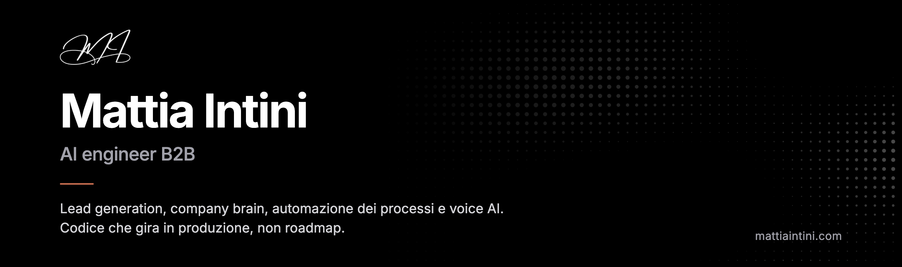
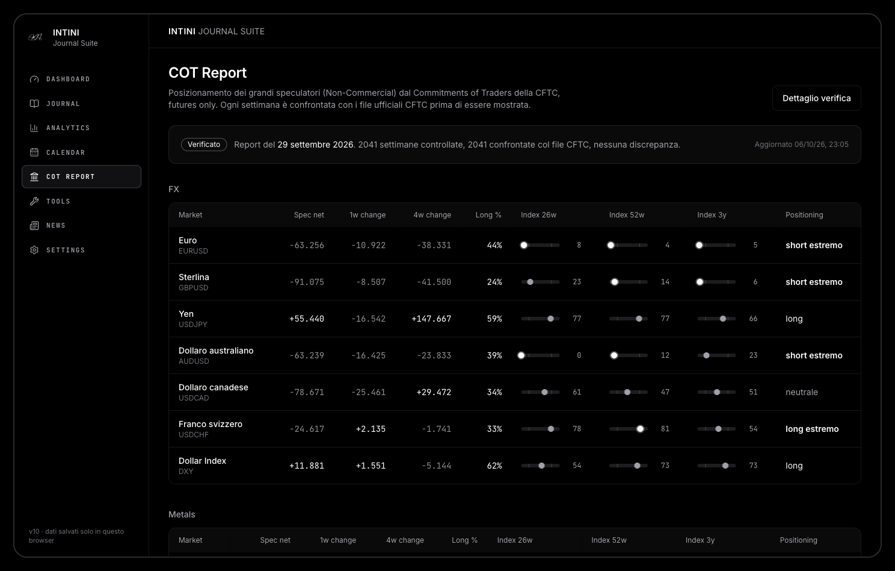
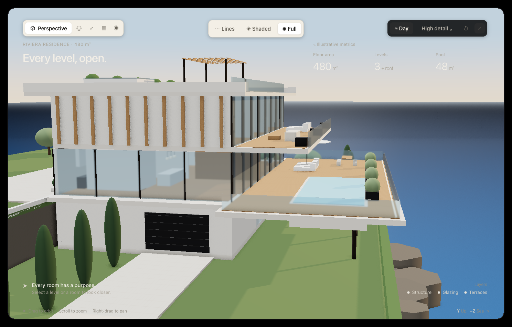
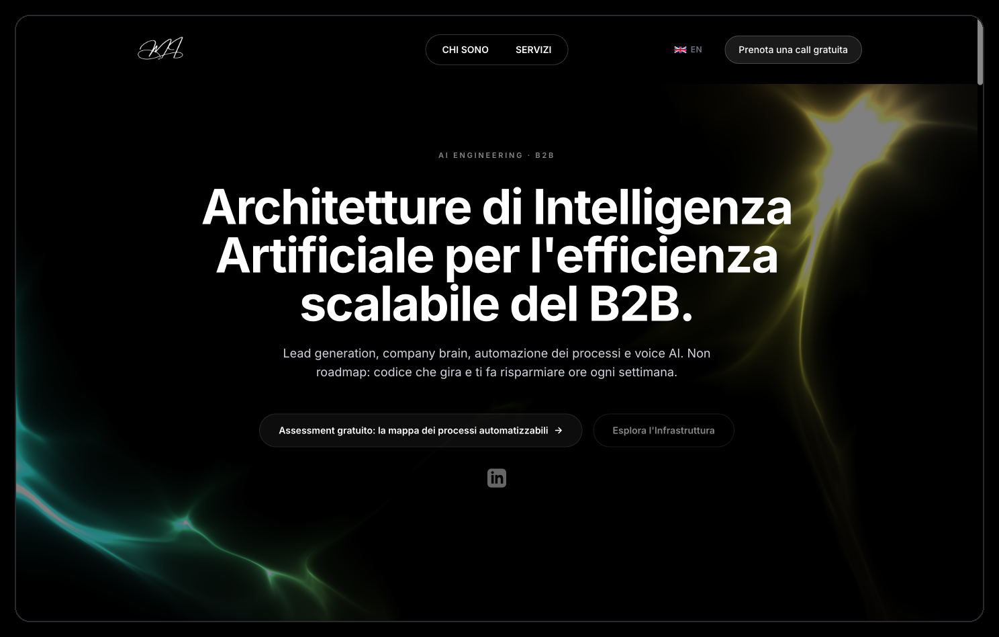

  
  
  

Progetto e metto in produzione sistemi AI dentro i processi delle aziende B2B. Non scrivo roadmap: consegno codice che gira, collegato agli strumenti che l'azienda usa già, con numeri che si possono misurare.

Gli stessi sistemi li uso prima di tutto sulle attività che gestisco in proprio. Quello che installo da un cliente l'ho già rotto e rimesso in piedi a casa mia.

 

## Core Solutions

| | |
|---|---|
| **Intelligent Outreach Engine** | Lead generation AI. Appuntamenti qualificati sul calendario del commerciale, non liste di contatti. Outbound scritto sul singolo destinatario. |
| **Data Sourcing & List Building** | Liste di aziende e decisori costruite sui criteri del cliente, con dati verificati alla fonte (registro imprese, Google Places, DataForSEO). |
| **Corporate Second Brain** | Quello che sa l'azienda diventa una domanda, non una ricerca tra le cartelle. Le risposte citano il documento da cui prendono il dato. |
| **Advanced Process Automation** | Agenti AI che tolgono il copia incolla tra un sistema e l'altro. Si parte dal collo di bottiglia, non dallo strumento di moda. |
| **Voice AI Agents** | Telefonia AI che risponde al primo squillo, con la dichiarazione di sistema automatico richiesta dall'AI Act. |
| **3D Visual Twins** | Render fotorealistici e gemelli 3D navigabili di ville e yacht, che si aprono piano per piano. |

 

## Selected Work

<table>
<tr>
<td width="50%" valign="top">

  
<b><a href="https://github.com/mattiaintini/trading-journal">Intini Journal Suite</a></b> 
Trading journal con report COT della CFTC verificato settimana per settimana contro i file ufficiali: oltre 2.000 settimane confrontate. Next.js 16, 73 test unitari e 59 controlli end to end.
  
<a href="https://intinijournaling.vercel.app">Live</a> · <a href="https://github.com/mattiaintini/trading-journal">Codice</a>
</td>
<td width="50%" valign="top">

  
<b><a href="https://riviera-residence-lab.vercel.app">AER Residential lab</a></b> 
Gemello 3D navigabile di una residenza sul mare, in three.js. Ogni livello si apre, ogni stanza si ispeziona, in vista prospettica o tecnica, giorno e notte.
  
<a href="https://riviera-residence-lab.vercel.app">Live</a>
</td>
</tr>
<tr>
<td width="50%" valign="top">

  
<b><a href="https://mattiaintini.com">mattiaintini.com</a></b> 
Sito bilingue in Next.js con instradamento per lingua, schemi dei servizi animati e assistente AI dichiarato come sistema automatico.
  
<a href="https://mattiaintini.com">Live</a>
</td>
<td width="50%" valign="top">
<b>Field Data</b>
  
<b>22.800</b> email mandate in produzione su tredici campagne outbound.
  
<b>14.579</b> contatti unici passati per la pipeline, fra ricerca, pulizia e verifica.
  
<b>4,6%</b> di risposte sulle campagne costruite sul verticale, su 10.797 email. Il mercato, su campagne di questa dimensione, si ferma al 2,1%.
  
<b>92</b> opportunità aperte.
  
La maggior parte del lavoro è per clienti e resta in repository privati. Qui trovate il codice che posso mostrare.
</td>
</tr>
</table>

 

## 3D Visual Twins

 

## Method

1. **Assessment tecnico.** Si mappano i processi e si trova il collo di bottiglia che costa di più.
2. **Build.** Il sistema si costruisce addosso a chi lo usa, collegato ai dati veri dell'azienda.
3. **Deployment & handover.** Messa in produzione, misurazione del risultato e passaggio di consegne. Niente vendor lock-in: il codice e i dati restano del cliente.

 

## Stack

  
  
  
  
  
  
  
  
  
  
  
  

 

## Contact

Se avete un processo che vi porta via ore ogni settimana, o un flusso di clienti che dipende ancora solo dal passaparola, scrivetemi a **info@mattiaintini.com** oppure prenotate una call da [mattiaintini.com](https://mattiaintini.com).

<b>English</b>

 
B2B AI engineer. I design and ship AI systems inside company workflows: lead generation, company brain, process automation, voice AI and 3D visual twins. Not roadmaps, but code running in production, wired into the tools a company already uses. Most of my work is client work and lives in private repositories.
  
<a href="https://mattiaintini.com/en">mattiaintini.com/en</a> · info@mattiaintini.com

